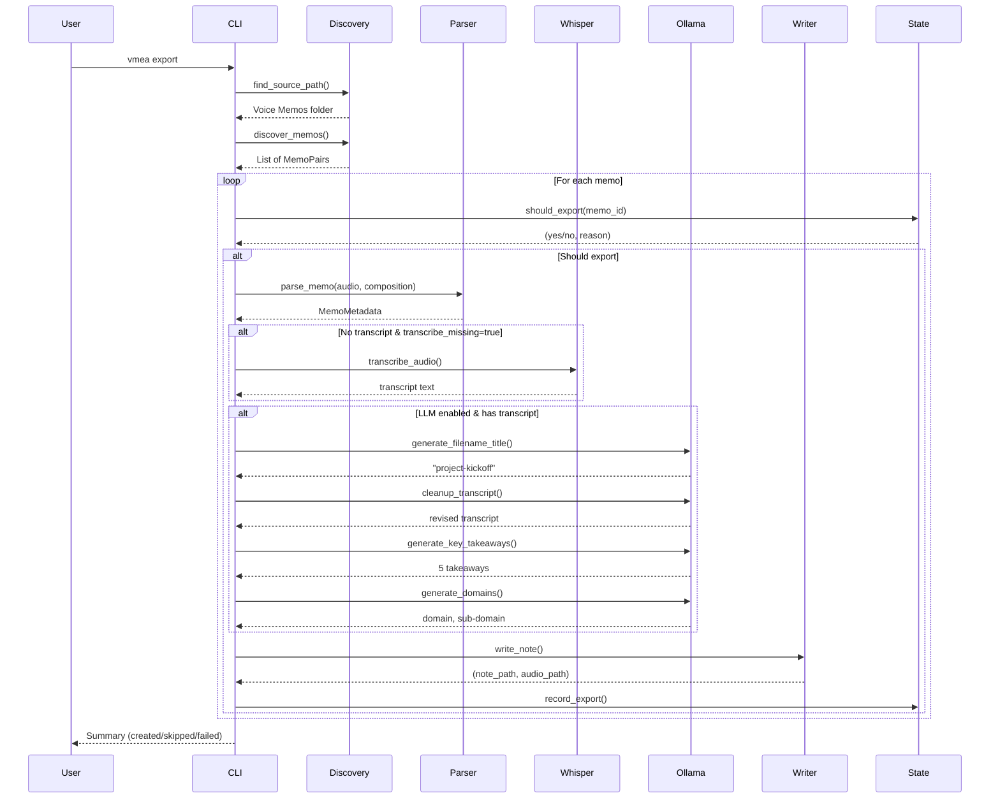
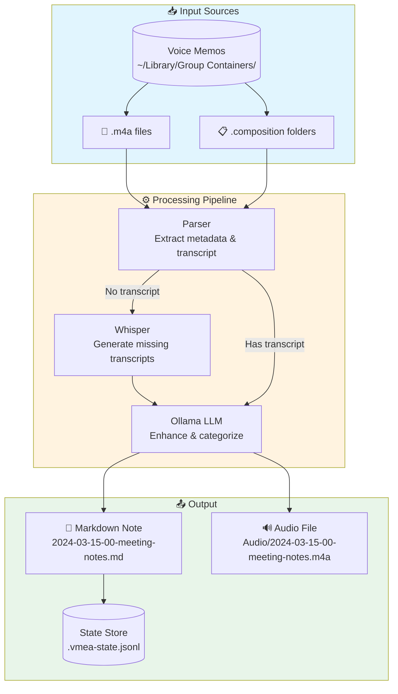
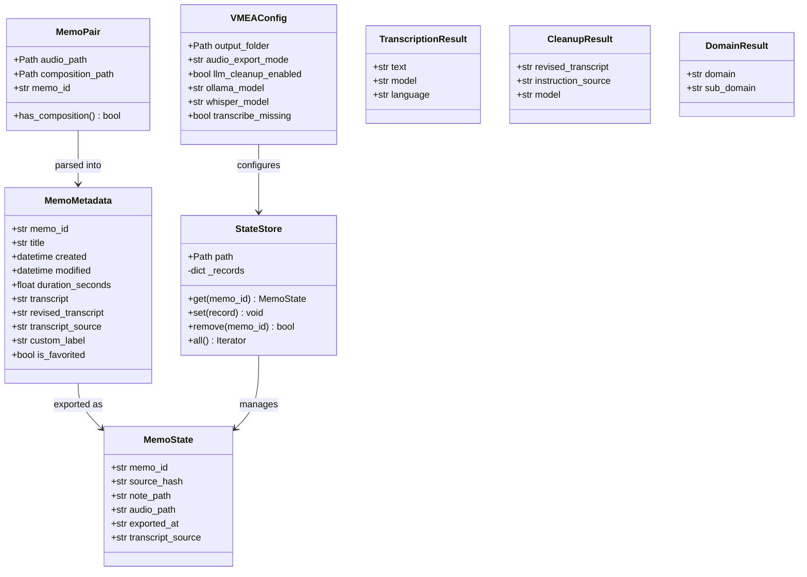
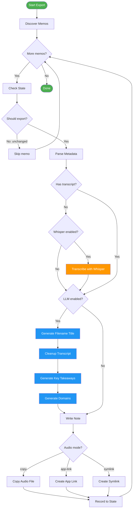
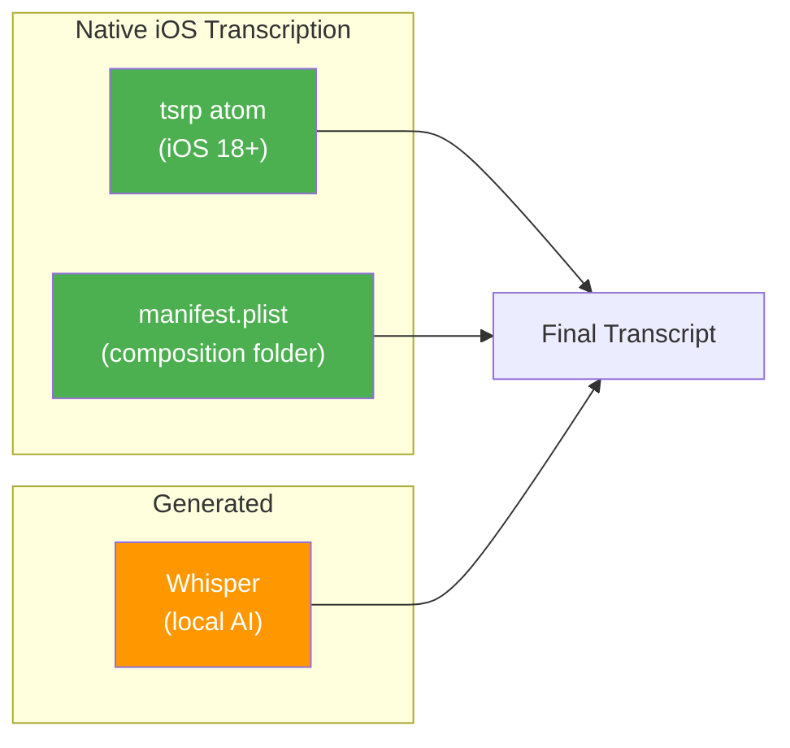

# Apple Voice Memo Export to Markdown

[](https://www.python.org/downloads/)
[](https://opensource.org/licenses/MIT)
[](https://www.apple.com/macos/)

Export Apple Voice Memos to markdown notes with AI-powered transcription and organization.

## Features

- 🎙️ **Automatic Export** – Convert Voice Memos to markdown with YAML frontmatter
- 🤖 **Whisper Transcription** – Generate transcripts for older memos without native transcription
- ✨ **LLM Enhancement** – Clean up transcripts, generate titles, key takeaways, and categorization
- 📁 **Smart Naming** – Auto-generated filenames: `YYYY-MM-DD-XX-descriptive-title.md`
- 🔗 **Flexible Audio** – Copy files, symlink, or link directly to Voice Memos app
- 👀 **Watch Mode** – Automatically export new memos as they're recorded
- 🔄 **Idempotent** – Re-run safely without creating duplicates

## Architecture Overview

### Export Flow



### Data Flow



### Class Diagram



### Decision Logic



## Installation

```bash
git clone https://github.com/klappe-pm/Apple-Voice-Memo-Export-to-Markdown.git
cd Apple-Voice-Memo-Export-to-Markdown
pip install -e .
```

### Optional Dependencies

```bash
# For Whisper transcription (older memos without native transcripts)
pip install -e ".[transcribe]"

# For LLM features (requires Ollama installed separately)
pip install -e ".[llm]"

# For development
pip install -e ".[dev]"
```

### Requirements

- **macOS 13+** (Ventura or later)
- **Python 3.11+**
- **Full Disk Access** permission (System Settings → Privacy & Security)
- **Ollama** (optional, for LLM features)

## Quick Start

```bash
# 1. Initialize configuration
vmea init

# 2. Export all memos
vmea export

# 3. Check system health
vmea doctor
```

## Output Format

### Filename Convention

```
YYYY-MM-DD-XX-descriptive-title.md
│    │  │  │   └── LLM-generated title slug
│    │  │  └────── Daily sequence (00, 01, 02...)
│    │  └───────── Day
│    └──────────── Month
└───────────────── Year
```

**Examples:**
- `2024-03-15-00-project-kickoff-meeting.md`
- `2024-03-15-01-afternoon-standup.md`
- `2024-03-15-02-client-call-notes.md`

### Note Structure

```yaml
---
domains: Technology
sub-domains: Software Development
llm-model: llama3.2:3b
date-created: 2024-03-15
date-revised: 2024-03-15
aliases:
tags:
---

# 2024-03-15-00-project-kickoff-meeting

## Voice Memo
![[Audio/2024-03-15-00-project-kickoff-meeting.m4a]]

## Key Takeaways
1. First key point from the memo.
2. Second key point from the memo.
3. Third key point from the memo.
4. Fourth key point from the memo.
5. Fifth key point from the memo.

### Revised Transcript
```markdown
Cleaned up transcript text...
```

### Original Transcript
```markdown
Raw transcript from iOS/Whisper...
```
```

## Commands Reference

### Core Commands

| Command | Description |
|---------|-------------|
| `vmea init` | First-run setup with folder picker |
| `vmea export` | Export all memos |
| `vmea export --memo-id <id>` | Export single memo |
| `vmea export --dry-run` | Preview without writing files |
| `vmea export --force` | Re-export even if unchanged |
| `vmea list` | List discovered memos |
| `vmea doctor` | System health check |
| `vmea config` | Show current configuration |

### Watch & Daemon

| Command | Description |
|---------|-------------|
| `vmea watch` | Foreground filesystem watcher |
| `vmea daemon install` | Install launchd background service |
| `vmea daemon uninstall` | Remove launchd service |
| `vmea daemon status` | Check daemon status |
| `vmea retry-failed` | Retry previously failed exports |

### Ollama (LLM)

| Command | Description |
|---------|-------------|
| `vmea ollama status` | Check Ollama server status |
| `vmea ollama start` | Start Ollama server |
| `vmea ollama models` | List available models |
| `vmea ollama select` | Interactively select a model |
| `vmea ollama pull <model>` | Pull a model from registry |

## Configuration

Config file: `~/.config/vmea/config.toml`

### Key Options

```toml
# Output settings
output_folder = "~/Documents/Voice Memos"
audio_export_mode = "copy"  # "copy", "symlink", or "app-link"

# Whisper transcription (for memos without native transcripts)
transcribe_missing = true
whisper_model = "base"  # tiny, base, small, medium, large

# LLM cleanup via Ollama
llm_cleanup_enabled = true
ollama_model = "llama3.2:3b"
ollama_host = "http://localhost:11434"
```

### Audio Export Modes

| Mode | Behavior |
|------|----------|
| `copy` | Copies .m4a to `output_folder/Audio/` |
| `symlink` | Creates symlink to original file |
| `app-link` | Creates clickable link to open Voice Memos app |

### Whisper Models

| Model | Size | Speed | Quality |
|-------|------|-------|--------|
| `tiny` | 39 MB | ⚡⚡⚡⚡ | ★★☆☆☆ |
| `base` | 74 MB | ⚡⚡⚡ | ★★★☆☆ |
| `small` | 244 MB | ⚡⚡ | ★★★★☆ |
| `medium` | 769 MB | ⚡ | ★★★★★ |
| `large` | 1.5 GB | 🐢 | ★★★★★ |

## Transcription Sources

VMEA extracts transcripts from multiple sources:



**Priority:** `tsrp` → `plist` → `whisper` (fallback)

## LLM Processing

When `llm_cleanup_enabled = true`, Ollama performs:

1. **Filename Title Generation** – Creates descriptive slug for filename
2. **Transcript Cleanup** – Fixes punctuation, paragraphs, artifacts
3. **Key Takeaways** – Extracts 5 main points
4. **Domain Categorization** – Assigns domain and sub-domain

### What LLM cleanup does:
- ✅ Fix punctuation and capitalization
- ✅ Improve paragraph breaks
- ✅ Correct obvious transcription errors
- ✅ Apply consistent formatting

### What LLM cleanup does NOT do:
- ❌ Summarize or shorten content
- ❌ Add information not present
- ❌ Interpret or editorialize
- ❌ Change the speaker's meaning

## Development

```bash
# Setup
python -m venv .venv
source .venv/bin/activate
pip install -e ".[dev,transcribe,llm]"

# Run tests
pytest

# Run tests with coverage
pytest --cov=vmea

# Type checking
mypy src/vmea

# Linting
ruff check src/vmea
```

## Project Structure

```
src/vmea/
├── __init__.py       # Package version
├── __main__.py       # Entry point
├── cli.py            # Typer CLI commands
├── config.py         # Pydantic config models
├── discovery.py      # Find Voice Memos folder
├── parser.py         # Extract metadata & transcripts
├── transcribe.py     # Whisper integration
├── cleanup.py        # Ollama LLM processing
├── writer.py         # Generate markdown notes
├── state.py          # JSONL state tracking
└── ollama.py         # Ollama server management
```

## Troubleshooting

### "Voice Memos folder not found"

1. Open Voice Memos app to trigger iCloud sync
2. Grant Full Disk Access in System Settings → Privacy & Security
3. Run `vmea doctor` to see which paths are checked

### "Whisper not installed"

```bash
pip install -e ".[transcribe]"
```

### "Ollama not running"

```bash
vmea ollama start
# or manually: ollama serve
```

## License

MIT – see [LICENSE](LICENSE)
