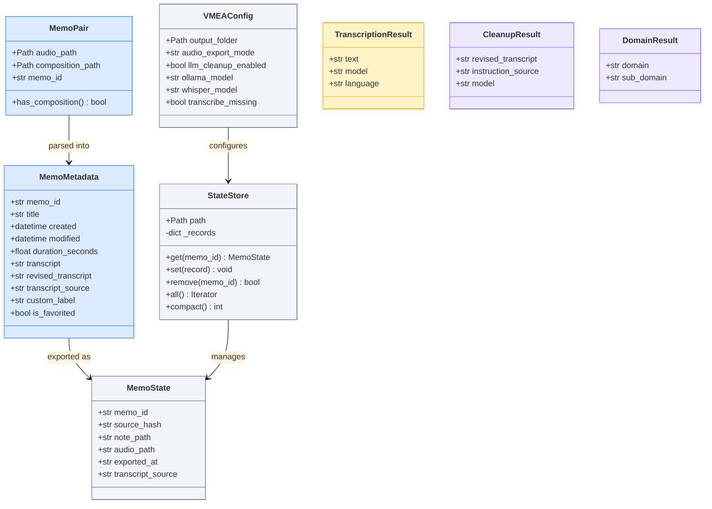

# Core Data Model Class Diagram
## Summary
This class diagram describes the primary VMEA data structures and their relationships, including memo metadata, export state records, configuration, and LLM/transcription result models.

