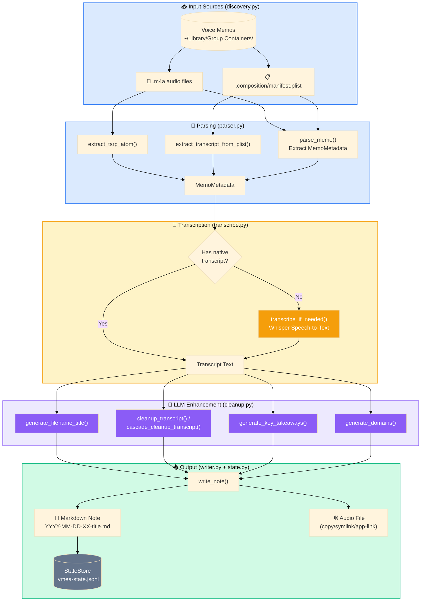

# Data Flow Pipeline Diagram
## Summary
This diagram explains how memo data flows through VMEA: source files are parsed by `parser.py`, transcripts are resolved (native `tsrp`/`plist` or Whisper fallback), optional LLM enrichment is applied via `cleanup.py`, and final markdown/audio outputs are written by `writer.py` and tracked in `state.py`.

