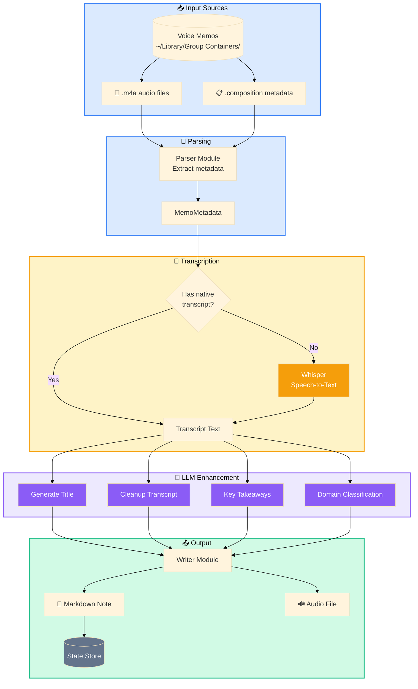

# Data Flow Pipeline Diagram
## Summary
This diagram explains how memo data flows through VMEA: source files are parsed, transcripts are resolved (native or Whisper), optional LLM enrichment is applied, and final markdown/audio outputs are written and tracked in state.

