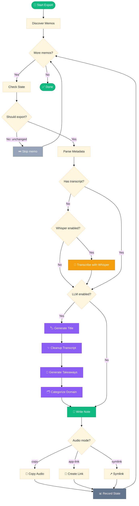

# Export Decision Flowchart
## Summary
This flowchart shows the branching logic used during export, including skip/re-export decisions, transcript availability checks, Whisper fallback, optional LLM steps, audio export mode handling, and state updates.

