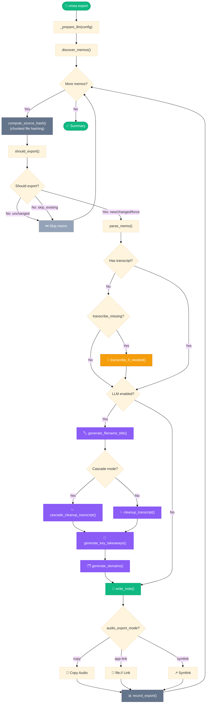

# Export Decision Flowchart
## Summary
This flowchart shows the branching logic inside `export_memo()`, including state-based skip/re-export decisions, transcript availability checks, Whisper fallback, optional LLM steps (single or cascade), audio export mode handling, and state recording.

