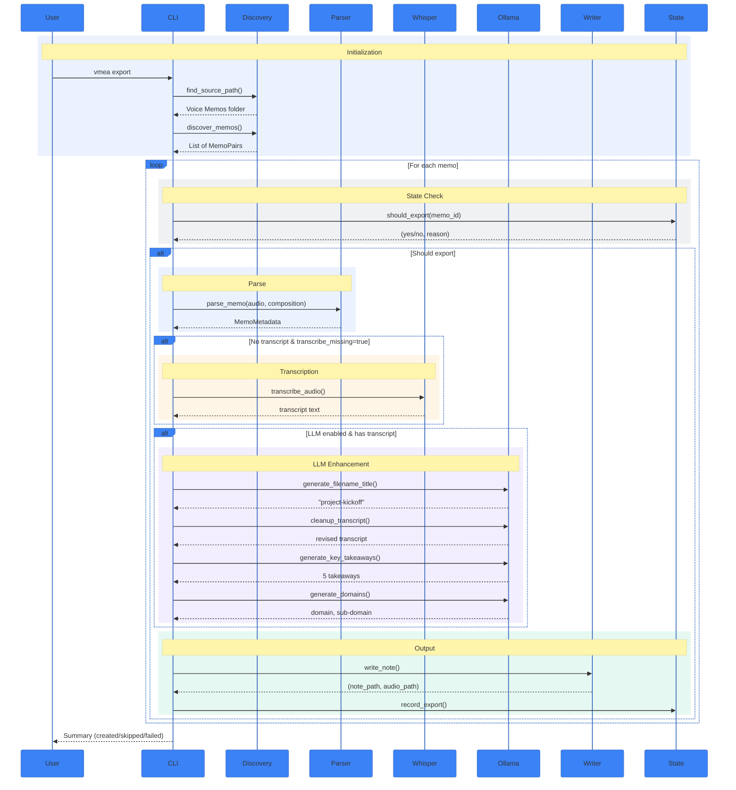

# Export Sequence Diagram
## Summary
This diagram shows the end-to-end runtime sequence of `vmea export`, including memo discovery, state checks, transcript extraction/transcription, LLM enrichment, note writing, and state recording.

