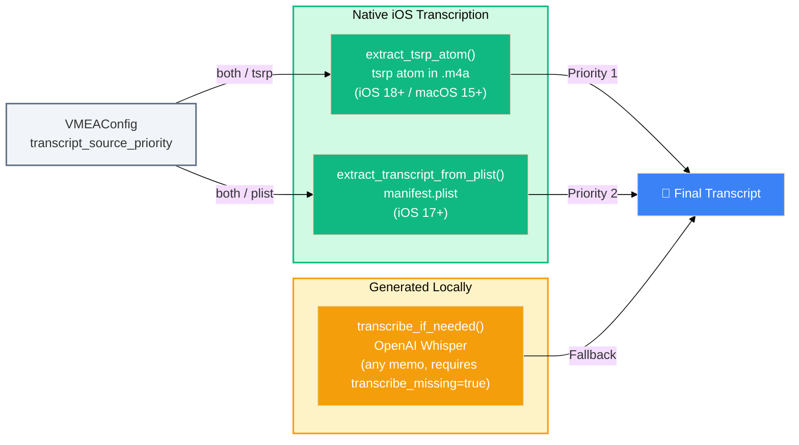

# Transcript Source Priority Diagram
## Summary
This diagram shows transcript source precedence controlled by `transcript_source_priority` in `VMEAConfig`. When set to `"both"` (default), VMEA prefers the `tsrp` atom (iOS 18+), then `manifest.plist` (iOS 17+), and falls back to local Whisper generation only when `transcribe_missing = true` and no native source is available.

