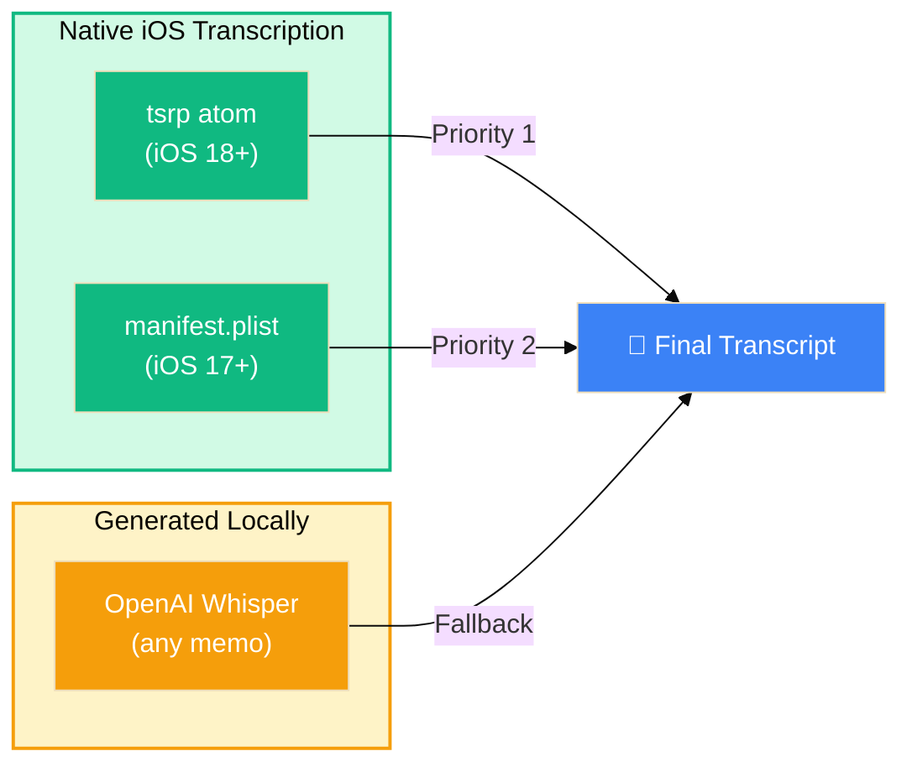

# Transcript Source Priority Diagram
## Summary
This diagram shows transcript source precedence: VMEA prefers native transcript data (`tsrp`, then `manifest.plist`) and falls back to local Whisper generation only when native sources are unavailable.

